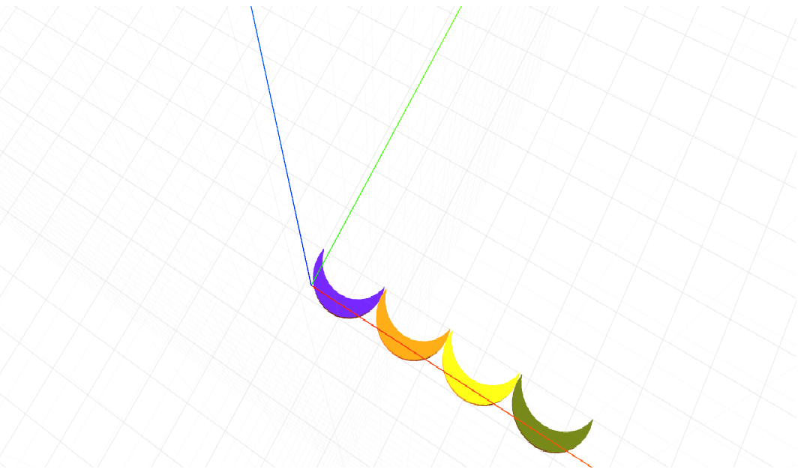

# craft-moon
Crescent Moon

#Install
$ npm install craft-moon

##Example:

    <craft>
        <craft name="moon" module="craft-moon"/>
        <moon ></moon>
        <moon ></moon>    
        <moon ></moon>
        <moon ></moon>
    </craft>

