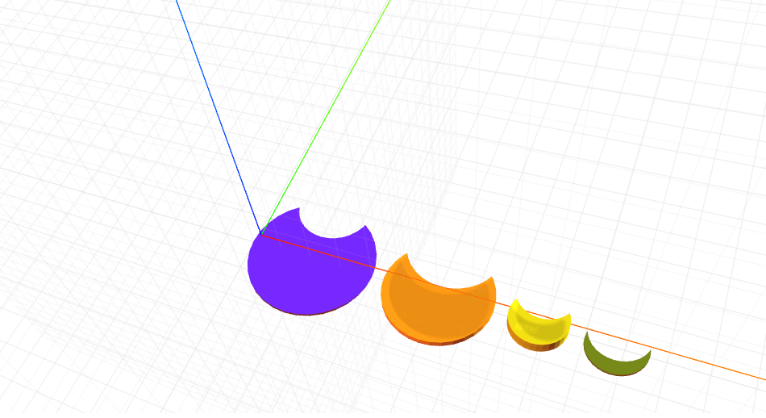

# craft-moon

    Crescent Moon

#Install:

    $ npm install craft-moon

##Example:

    <craft>
    <craft name="moon" module="craft-moon"/>
    <lineup axis="x" spacing="1">
    <moon></moon>
    <moon crescent="3.5" radius="4" height="0.5"></moon>
    <moon crescent="2" radius="2" height="1"></moon>
    <moon crescent="2" radius="1"></ moon>
    </lineup>
    </craft>

